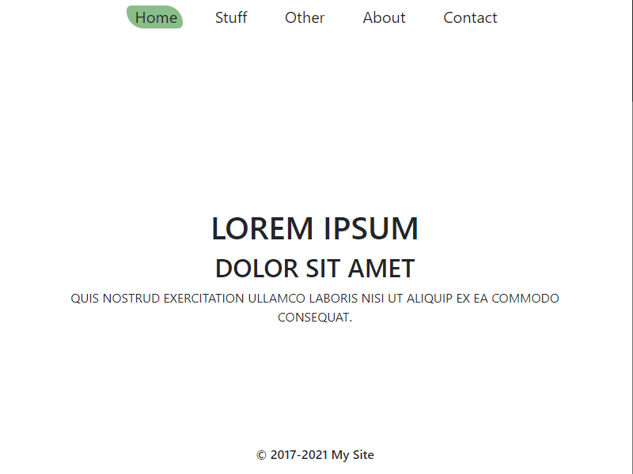
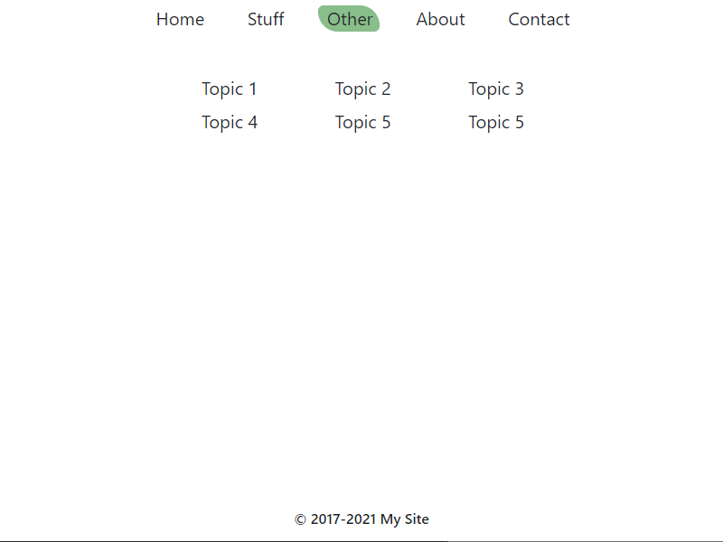

# Website Template with Markdown Rendering and PDF Output

Welcome! I hope you find this template useful. I enjoyed creating it and I use it myself. 

github.com/jxmot/website_template-markdown

## By Design...

This template was created so that I could fulfill a specific need that I had. I wanted a simple website that was capable of using *Markdown* text files for content. In addition, content changes or updates would **not** require any coding changes. Even if the content file names changed or if the files were relocated.

There are some additional features that I required:

* Be ***functional***. Just add content, make a few minor changes, and you've got a website.
* Configurable:
  * `<meta>` tags
  * Form debugging on/off
  * Miscellaneous text content
* Intended for dynamic content:
  * The browsers' URL bar is managed. Hash tag (`#`) links are not allowed to be seen. 
  * The "table of contents" and the content files are read *on demand* and rendered. 
  * Links back to the site(page) will always be to the landing.
* PDF Export: The ability to export selective content to PDF.
* A minimal and lightweight appearance.
* Small code footprint, < 200k not including third party libraries(~1.7m).

### Appearance & Functionality

For the most part the appearance is plain. With just a little embellishment on the navigation menu. Other than white, the colors are subdued.

The initial page load and the transitions between navigation menu items utilize a brief fade-in instead of a harsh instant-on transition.

<p align="center">
  
</p>

## What's Here

```
+---public_html
    |
    +---php
    |
    +---assets
    |   |
    |   +---css
    |   |
    |   +---js
    |       |
    |       +---html2pdf.js-0.9.2
    |       |   |
    |       |   +---dist
    |       |
    |       +---showdown-1.9.1
    |           |
    |           +---dist
    |
    +---mdfiles
        |
        +---content

```

Where:

* `public_html` - This folder represents the document root on the server, it contains`index.php`.
  * `php` - contains all PHP support files used in this project 
  * `assets` - sub-folder names are self explanatory
  * `mdfiles` - PHP files for creating a *table of contents* and an HTML snippet used in PDF creation.
    * `content` - configuration files for rendering TOCs(*table of content*) and text files formatted in Markdown that are used as content.

## What's Required

**Server**: For testing out the template you will need PHP >=5.6. So if you're running on a PC a program like XAMPP(www.apachefriends.org) will work. If you're running the template on an internet hosting server the same requirements apply.

**Other**: Your favorite editor, and if you're using an internet hosting server you will need a way to get the files onto it.

Here is a collection of tools that I use for development - github.com/jxmot/Toolbox

## First Deployment

**PC Hosted**: Copy the contents of the `public_html` folder into the document root of your HTTP server. However, I recommend that you create a sub-folder in the document root and copy the files there.

**Internet Hosted**: Same recommendation here, create a sub-folder in your server's HTTP doument root and copy the contents of the `public_html` folder into there.

## Updating Content

The markdown content is contained in `public_html/mdfiles/content/` and related files are contained in `public_html/mdfiles/`.

```
+---public_html
    |
    +---mdfiles
        |
        +---content

```

### Table of Contents

The file `public_html/mdfiles/toc.php` is used for rendering the "table of contents" that appears when the appropriate nav menu item is chosen.

<p align="center">
  
</p>

By passing a text file path+name to `toc.php` different tables can be rendered. For example, the `public_html/mdfiles/content/toc.txt` file contains - 

```
Topic 1,./mdfiles/content/pastlorem.md
Topic 2,./mdfiles/content/loremipsum.md
Topic 3,./mdfiles/content/loremipsum.md
Topic 4,./mdfiles/content/loremipsum.md
Topic 5,./mdfiles/content/loremipsum.md
Topic 5,./mdfiles/content/loremipsum.md
```

The text file is read by the script, and parsed into an array of objects. That is where TOC items text and resource pointers (a path to a markdown text file) are stored. 

Make sure there is no blank line at the end of the file. 

The TOC is rendered with a maximum of 3 items on a line. For >3 items a new row is created as needed.

### Markdown Content Files

Clicking on a "Topic" will render and display the associated markdown content file -

<p align="center">
  
</p>

The "Save PDF" prompt and button will be seen only *if enabled in the markdown content file*.

### Enabling Save to PDF

Enabling is done on a per-file basis. Each markdown content file can enable PDF save as desired. Just add the this line followed by a blank line - 

```
<div id="mddocpdf" style="display:none;"></div>
```

### Editing the Navigation Menu

