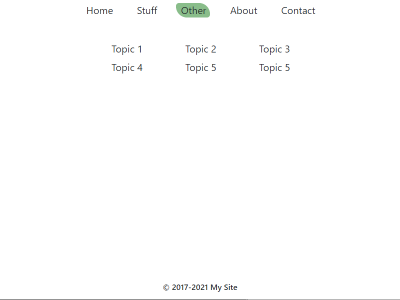
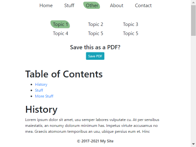

# Website Template with Markdown Rendering and PDF Output

Welcome! I hope you find this template useful. I enjoyed creating it and I use it myself. 

github.com/jxmot/website_template-markdown

## By Design...

This template was created so that I could fulfill a specific need that I had. I wanted a simple website that was capable of using *Markdown* text files for content. In addition, content changes or updates would **not** require any coding changes. Even if the content file names changed or if the files were relocated.

There are some additional features that I required:

* Be ***functional***. Just add content, make a few minor changes, and you've got a website.
* Configurable:
  * `<meta>` tags
  * Form debugging on/off
  * Miscellaneous text content
* Intended for dynamic content:
  * The browsers' URL bar is managed. Hash tag (`#`) links are not allowed to be seen. 
  * The "table of contents" and the content files are read *on demand* and rendered. 
  * Links back to the site(page) will always be to the landing.
* PDF Export: The ability to export selective content to PDF.
* Alternate font: The ability to alternate between two fonts for display and output to PDF(*currently not working, investigating potential fixes and work-arounds*).
* A minimal and lightweight appearance.
* Small code footprint, < 200k not including third party libraries(~1.7m).

### Appearance & Functionality

For the most part the appearance is plain. With just a little embellishment on the navigation menu. Other than white, the colors are subdued.

The initial page load and the transitions between navigation menu items utilize a brief fade-in instead of a harsh instant-on transition. This logic is implemented in `assets/js/menu.js:runMenu()`.

<p align="center">
  
</p>

## What's Here

```
+---public_html
    |
    +---php
    |
    +---assets
    |   |
    |   +---css
    |   |
    |   +---js
    |       |
    |       +---html2pdf.js-0.9.2
    |       |   |
    |       |   +---dist
    |       |
    |       +---showdown-1.9.1
    |           |
    |           +---dist
    |
    +---mdfiles
        |
        +---content

```

Where:

* `public_html` - This folder represents the document root on the server, it contains`index.php`.
  * `php` - contains all PHP support files used in this project 
  * `assets` - sub-folder names are self explanatory
  * `mdfiles` - PHP files for creating a *table of contents* and an HTML snippet used in PDF creation.
    * `content` - configuration files for rendering TOCs(*table of content*) and text files formatted in Markdown that are used as content.

## What's Required

**Server**: For testing out the template you will need PHP >=5.6. So if you're running on a PC a program like XAMPP(www.apachefriends.org) will work. If you're running the template on an internet hosting server the same requirements apply.

**Other**: Your favorite editor, and if you're using an internet hosting server you will need a way to get the files onto it.

Here is a collection of tools that I use for development - github.com/jxmot/Toolbox

## First Deployment

**PC Hosted**: Copy the contents of the `public_html` folder into the document root of your HTTP server. However, I recommend that you create a sub-folder in the document root and copy the files there.

**Internet Hosted**: Same recommendation here, create a sub-folder in your server's HTTP doument root and copy the contents of the `public_html` folder into there.

## Updating Content

The markdown content is contained in `public_html/mdfiles/content/` and related files are contained in `public_html/mdfiles/`.

```
+---public_html
    |
    +---mdfiles
        |
        +---content

```

### Table of Contents

The file `public_html/mdfiles/toc.php` is used for rendering the "table of contents" that appears when the appropriate nav menu item is chosen.

<p align="center">
  
</p>

By passing a text file path+name to `toc.php` different tables can be rendered. For example, the `public_html/mdfiles/content/toc.txt` file contains - 

```
Topic 1,./mdfiles/content/pastlorem.md
Topic 2,./mdfiles/content/loremipsum.md
Topic 3,./mdfiles/content/loremipsum.md
Topic 4,./mdfiles/content/loremipsum.md
Topic 5,./mdfiles/content/loremipsum.md
Topic 5,./mdfiles/content/loremipsum.md
```

The text file is read by the script, and parsed into an array of objects. That is where TOC items text and resource pointers (a path to a markdown text file) are stored. 

Make sure there is no blank line at the end of the file. 

The TOC is rendered with a maximum of 3 items on a line. For >3 items a new row is created as needed.

### Markdown Content Files

Clicking on a "Topic" will render and display the associated markdown content file -

<p align="center">
  
</p>

The "Save PDF" prompt and button will be seen only *if enabled in the markdown content file*.

## Rendering Content

I used showdow.js 1.9.1 (github.com/showdownjs/showdown) to render the markdown to HTML. The copy in this repository has been modified by me - 

* Add CSS classes to all `<hX>` tags, with the ability to optionally skip the firs heading tag.
* When `completeHTMLDocument` is `true` - 
  * Add CSS classes to `<body>`
  * Include custom: `<meta>`, `<style>` links and CSS, `<script>` links and code
  * Include custom HTML at either just after the `<body>` or just before the `</body>`

### Enabling Save to PDF

Enabling is done on a per-file basis. Each markdown content file can enable PDF save as desired. Just add the this line followed by a blank line to the top of the file - 

```
<div id="mddocpdf" style="display:none;"></div>
```

**NOTE**: A table of contents must also be present. The "Save PDF" button is rendered with the TOC.

### Known PDF Issues

To create and save the PDF I used html2pdf.js v0.9.2 (github.com/eKoopmans/html2pdf.js). I tried several other solutions without success. Although html2pdf.js is working for me *there are limitations*. Its current version at the time (v0.9.2) is built with out of date version of jsPDF, html2canvas, and es6-promise. The most noticeable aspect of the out dated dependencies is that some of the *documented options* are newer and do not exist in the jsPDF version used (v1.4.1). jsPDF (github.com/MrRio/jsPDF) is currently at v2.3.1.

**Known Issues**:

* Links do not render correctly, they always contain the base URI when the PDF was created.
* Page breaks, I'm not absolutely sure there's a problem. I'll read the docs again and see if I can get it working better.
* In certain circumstances `&nbsp;` will **not** render correctly. For example, let's say you have a markdown heading like this - 

```
###### &nbsp;&nbsp;&nbsp;&nbsp;**Site Content**
```

Where the `&nbsp;` is there for force some indenting. And it's *expected* to render as this - 

```
<h6 id="site-content">&nbsp;&nbsp;&nbsp;&nbsp;<strong>Site Content</strong></h6>
```

But this is was is rendered instead - 

```
<h6 id="nbspnbspnbspnbspsite-content">&nbsp;&nbsp;&nbsp;&nbsp;<strong>Site Content</strong></h6>
```

* Render fonts - It seems that changing fonts does not work well. The HTML gets rendered properly with the CSS classes. And if viewed independently the rendered HTML does apply the correct font. After some research it appears that the dependency `html2canvas` (*of html2pdf.js*) is responsible for the font(s). But `jsPDF` (*another dependency*) has the `.addFont()` function but it does not appear to be exposed or usable.

### Enabling the Font Select Menu

Enabling is done on a per-file basis. Each markdown content file can enable font selection as desired. Just add the this line followed by a blank line to the top of the file - 

```
<div id="mddocfont" style="display:none;"></div>
```

**NOTE**: A table of contents must also be present. The Choose Font Below" buttons are rendered with the TOC.

## Editing the Navigation Menu

This works like the TOC. A text file contains the navigation menu item text and an associated HTML id. For example, the `public_html/php/navmenu.txt` file contains - 

```
Home,navsel_1
About,navsel_4
Other,navsel_3
Stuff,navsel_2
Contact,navsel_5
```

Make sure there is no blank line at the end of the file. 

The text to the left of the commas are the text used in the menu items. The right side should not be edited, it associates the menu text with a action impmented in `public_html/assets/js/menu.js`.

At this time the navigation menu is fixed at 5 items with no sub-menus. 

The `navmenu.txt` file can be chosen by editing `index.php`. Find the following in `index.php`:

```
        <div class="container" id="nav-container">
            <nav class="navbar navbar-expand-md fixed-top navbar-light navbar-bglight">
                <button class="navbar-toggler" type="button" data-toggle="collapse" data-target="#sitenavbar">
                    <span class="navbar-toggler-icon"></span>
                </button>
                <div class="collapse navbar-collapse" id="sitenavbar">
<?php
// Configure the Nav Menu
$_SESSION['navmenutxt'] = './php/navmenu2.txt'; 
require_once './php/navmenu.php'; 
?>
                </div>
            </nav>
        </div>
```

Edit the line - 

```
$_SESSION['navmenutxt'] = './php/navmenu2.txt';
```

and change the text file to the one you want to use.

## Editing the Navigation Menu **Actions**

The *logic* of this web page is implemtented in `public_html/assets/js/menu.js:runMenu()`. Each menu item will initiate a jQuery `.show()` and fade-in when activated. Two of the actions will open and render a TOC when activated.

Changes would only need to occur in `public_html/assets/js/menu.js:runMenu()` when altering how the menu items work.

## Site Options Configuration

The file `public_html/php/siteoptions.php` contains configuration settings used in `index.php` and the PHP support files. It contains the following types of options:

* Debug modes for forms and IP logging
* Logging file format
* Form settings, email addresses, subject line
* Site and page title, description, and author
* HTML Language settings
* Footer message

---
